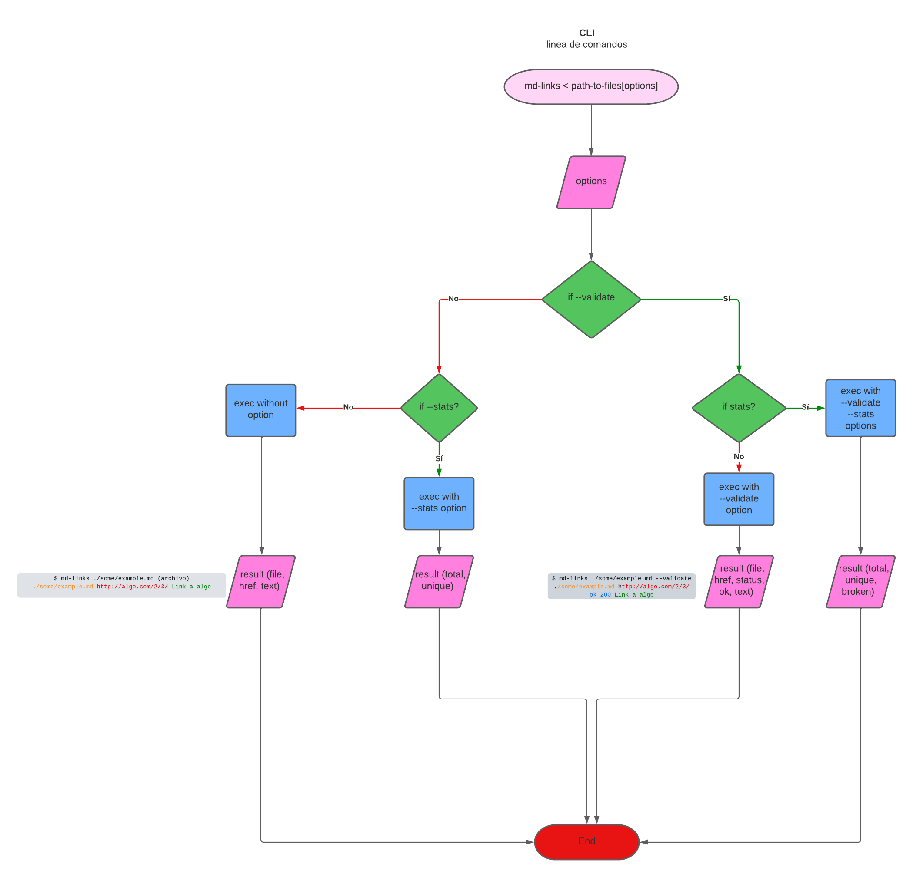

# Markdown Links

## Índice

* [1. Preámbulo](#1-preámbulo)
* [2. Descripción](#2-Descripción)
* [3. Objetivos de aprendizaje](#3-objetivos-de-aprendizaje)
* [4. Diagramas de flujo](#4-diagramas-de-flujo)
* [5. Instalación](#5-Instalación)
* [6. Uso](#6-uso)
* [7. Pruebas Unitarias](#7-pruebas-unitarias)
* [8. Checklist](#9-checklist)

***

## 1. Preámbulo

Markdown es un lenguaje de marcado ligero muy popular entre developers. 
Es usado en muchísimas plataformas que manejan texto plano (GitHub, foros, blogs, ...) 
y es muy común encontrar varios archivos en ese formato en cualquier tipo de
repositorio (empezando por el tradicional `README.md`).

Estos archivos `Markdown` normalmente contienen _links_ (vínculos/ligas) que
muchas veces están rotos o ya no son válidos y eso perjudica mucho el valor de
la información que se quiere compartir. 

Dentro de una comunidad de código abierto, nos han propuesto crear una
herramienta usando Node.js, que lea y analice archivos
en formato `Markdown`, para verificar los links que contengan y reportar
algunas estadísticas. 

## 2. Descripción

Es una herramienta de línea de comando(CLI) y una librería, que permite extraer
los links de un archivo tipo Markdown(md), e identifica cuales están funcionando y 
cuales están rotos. Adicionalmente esta información se puede entregar al usuario 
como estadísticas donde se puede ver:

* Total de links
* Links únicos
* Links rotos

## 3. Objetivos de aprendizaje

Objetivos aplicados en este proyecto.

### JavaScript

- [X] **Diferenciar entre tipos de datos primitivos y no primitivos**

- [X] **Arrays (arreglos)**

  * Arreglos
  * Array - MDN
  * Array.prototype.sort() - MDN
  * Array.prototype.forEach() - MDN
  * Array.prototype.map() - MDN
  * Array.prototype.filter() - MDN
  * Array.prototype.reduce() - MDN

- [X] **Objetos (key, value)**

- [X] **Uso de condicionales (if-else, switch, operador ternario, lógica booleana)**

  * Estructuras condicionales y repetitivas
  * Tomando decisiones en tu código — condicionales - MDN

- [X] **Funciones (params, args, return)**

  * Funciones (control de flujo)
  * Funciones clásicas
  * Arrow Functions
  * Funciones — bloques de código reutilizables - MDN

- [X] **Recursión o recursividad**

- [X] **Diferenciar entre expresiones (expressions) y sentencias (statements)**

- [X] **Promesas**

- [X] **Pruebas unitarias (unit tests)**

  * Jest

- [X] **Pruebas asíncronas**

  * Tests de código asincrónico con Jest 

- [X] **Pruebas de compatibilidad en múltiples entornos de ejecución**

- [X] **Uso de linter (ESLINT)**

- [X] **Uso de identificadores descriptivos (Nomenclatura y Semántica)**

### Node.js

- [X] **Instalar y usar módulos con npm**

- [X] **Configuración de package.json**

- [X] **Configuración de npm-scripts**

- [X] **process (env, argv, stdin-stdout-stderr, exit-code)**

- [X] **File system (fs, path)**

### Control de Versiones (Git y GitHub)

- [X] **Git: Instalación y configuración**

- [X] **Git: Control de versiones con git (init, clone, add, commit, status, push, pull, remote)**

- [X] **Git: Integración de cambios entre ramas (branch, checkout, fetch, merge, reset, rebase, tag)**

- [X] **GitHub: Creación de cuenta y repos, configuración de llaves SSH**

- [X] **GitHub: Colaboración en Github (branches | forks | pull requests | code review | tags)**

- [X] **GitHub: Organización en Github (projects | issues | labels | milestones | releases)**

### HTTP

- [X] **Consulta o petición (request) y respuesta (response).**

- [X] **Códigos de status de HTTP**

## 4. Diagramas de flujo

* API

* CLI

## 5. Instalación

Mediante npm, colocando en la terminal:

npm install gloVillagran/DEV004-md-links

## 6. Uso

Este proyecto consta de DOS partes: 

### 1) JavaScript API

Esta es una funcion que retorna una promesa mdLinks(path, options) que recibe dos parámetros: 
path (ruta absoluta o relativa) y options ({validate: true} o {validate: false}) 
que retorna un array de objetos por cada link.

##### Valor de retorno

Con `validate:false` :

* `href`: URL encontrada.
* `text`: Texto que aparecía dentro del link (`<a>`).
* `file`: Ruta del archivo donde se encontró el link.

Con `validate:true` :

* `href`: URL encontrada.
* `text`: Texto que aparecía dentro del link (`<a>`).
* `file`: Ruta del archivo donde se encontró el link.
* `status`: Código de respuesta HTTP.
* `ok`: Mensaje `fail` en caso de fallo u `ok` en caso de éxito.

### 2) CLI (Command Line Interface - Interfaz de Línea de Comando)

El ejecutable de nuestra aplicación debe poder ejecutarse de la siguiente
manera a través de la **terminal**:

Comando principal: 

`md-link`

Para poder visualizar todas las opciones que tiene el recurso, se ejecuta: 

`md-link --help`

Para poder visualizar los **links** encontrados en el/los archivos md, se ejecuta sin pasar
opciones, se obtendrá información de cada link encontrado. [{ href, text, file }]: 

`md-link <path-to-file>`

Por ejemplo: 

`md-link'/Users/gloriavillagranrojas/Laboratoria DEV004/MDLinks/DEV004-md-links/md-files/prueba-Links.md' `

#### Options

Se debe ejecutar con las siguientes opciones: 

`md-links <path-to-file> [options]`

##### `--validate`

Si pasamos la opción `--validate`, el módulo debe hacer una petición HTTP para
averiguar si el link funciona o no. Si el link resulta en una redirección a una
URL que responde ok, entonces consideraremos el link como ok.

Por ejemplo:

`md-link '/Users/gloriavillagranrojas/Laboratoria DEV004/MDLinks/DEV004-md-links/md-files/prueba-Links.md' --validate`

##### `--stats`

Si pasamos la opción `--stats` el output (salida) será un texto con estadísticas
básicas sobre los links.

Por ejemplo: 

`md-link '/Users/gloriavillagranrojas/Laboratoria DEV004/MDLinks/DEV004-md-links/md-files/prueba-Links.md' --stats`

%2013.27.08.png)

##### `--validate --stats`

También se puede combinar `--stats` y `--validate` para obtener estadísticas que
necesiten de los resultados de la validación.

Por ejemplo: 

`md-link '/Users/gloriavillagranrojas/Laboratoria DEV004/MDLinks/DEV004-md-links/md-files/prueba-Links.md' --validate --stats`

## 7. Pruebas Unitarias 

Se realizaron 20 test unitarios para cada una de las funciones de la API, como también para testear el funcionamiento completo de la función **md-links**.

## 8. Checklist

### General

* [X] Puede instalarse via `npm install --global <github-user>/md-links`

### `README.md`

* [X] Un board con el backlog para la implementación de la librería.
* [X] Documentación técnica de la librería.
* [X] Guía de uso e instalación de la librería

### API `mdLinks(path, opts)`

* [X] El módulo exporta una función con la interfaz (API) esperada.
* [X] Implementa soporte para archivo individual
* [X] Implementa soporte para directorios
* [X] Implementa `options.validate`

### CLI

* [X] Expone ejecutable `md-links` en el path (configurado en `package.json`)
* [X] Se ejecuta sin errores / output esperado
* [X] Implementa `--validate`
* [X] Implementa `--stats`

### Pruebas / tests

* [X] Pruebas unitarias cubren un mínimo del 70% de statements, functions,
  lines, y branches.
* [X] Pasa tests (y linters) (`npm test`).

